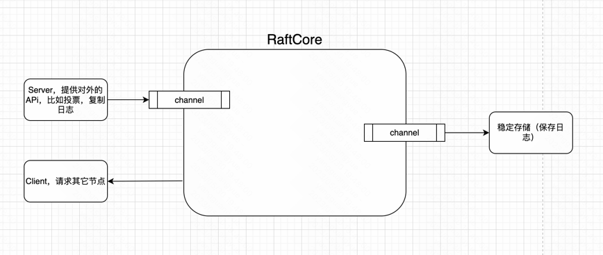

# 实现过程记录

## 分支 feature_v1

上图展示了raft最基础的组成部分：
- RaftCore：算法的具体实现
- Server：因为要跟其它节点通信，所以需要对外暴露API；Server的具体实现，不需要限制，只要能通信就行
- Client：提供请求其它节点Server的能力
- 稳定存储：用来保存一些需要持久化的数据，比如日志，快照等

另外，跟Server和稳定存储的交互，通过channel实现，因为RaftCore是异步的